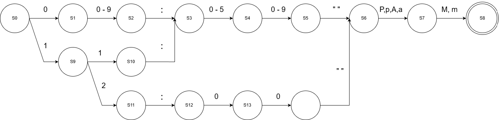
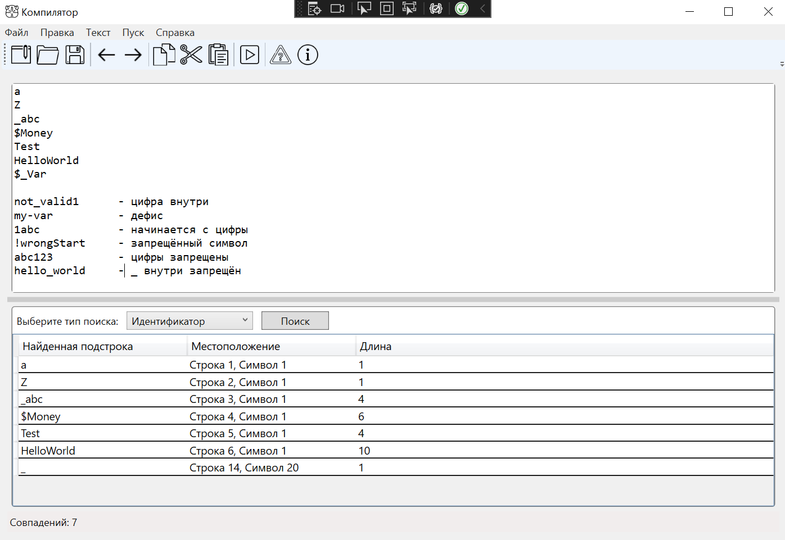
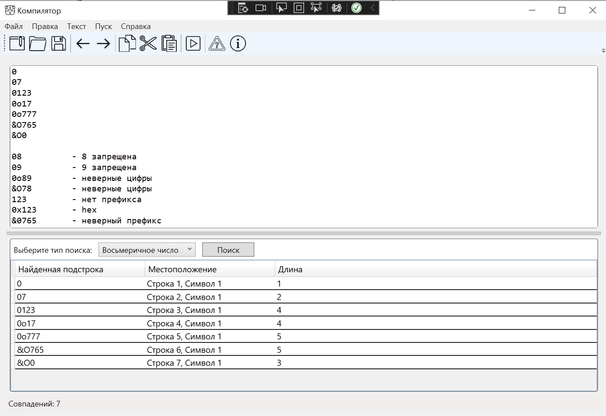
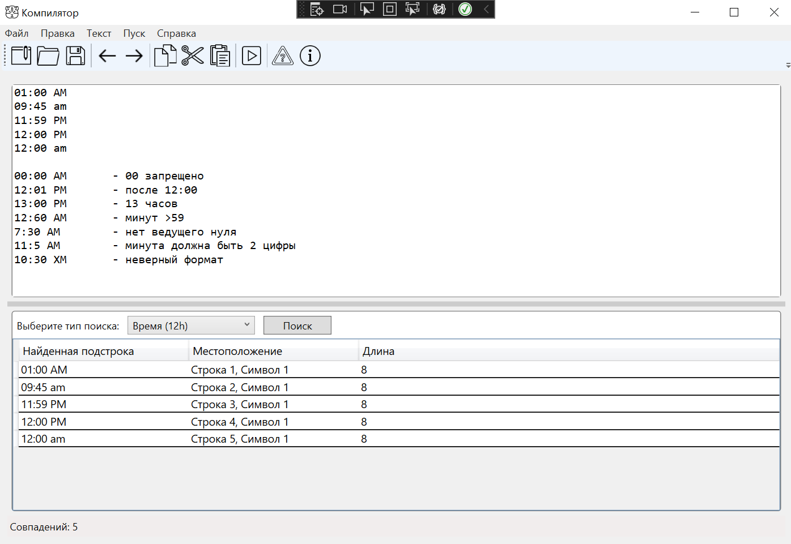

# Лабораторная работа №4

**Цель:** Реализация алгоритма поиска подстрок в тексте с использованием регулярных выражений и автомата для 12-часового времени.

**Автор:** Пузырный Даниил Алексеевич
**Группа:** АП-327
**Номер варианта:**  15	26	22

---

## 1. Постановка задачи

**Вариант:**

1. Построить регулярное выражение для поиска идентификаторов, которые могут начинаться только с буквы `[a-zA-Z]`, знака доллара `$` или подчеркивания `_`, а остальные символы могут быть только буквами `[a-zA-Z]`.
2. Построить регулярное выражение для поиска восьмеричных чисел с префиксами `0o`, `&O` или `0`.
3. Построить регулярное выражение для поиска времени в 12-часовом формате `ЧЧ:ММ` с указанием `AM/PM`.

**Дополнительно:** Реализовать поиск времени с помощью автомата (построение графа состояний).

---

## 2. Решение задач

### Задача 1. Идентификаторы

**Описание задачи:**
Идентификатор должен начинаться с `[a-zA-Z$_]`, остальные символы — только `[a-zA-Z]`. Считывается до пробела, конца строки или разделителя.

**Регулярное выражение:**

```regex
(?<!\S)[a-zA-Z$_][a-zA-Z]*(?=\s|$|[.,;:!?])
```

**Пояснение:**

* `(?<!\S)` — отрицательный просмотр назад: перед словом не должно быть непробельного символа (начало слова).
* `[a-zA-Z$_]` — первый символ: буква, `$` или `_`.
* `[a-zA-Z]*` — последующие символы: только буквы.
* `(?=\s|$|[.,;:!?])` — отрицательный просмотр вперёд: после слова либо пробел, конец строки, либо знаки препинания.

**Примеры правильных идентификаторов:**

```
a
Z
_abc
$Money
Test
HelloWorld
$_Var
```

**Примеры неправильных идентификаторов:**

```
not_valid1
my-var
1abc
!wrongStart
abc123
hello_world
```

---

### Задача 2. Восьмеричные числа

**Описание задачи:**
Восьмеричное число должно иметь префикс `0o`, `&O` или быть просто `0` и состоять из цифр `0-7`.

**Регулярное выражение:**

```regex
(?<!\S)(0o[0-7]+|&O[0-7]+|0(?![0-7])|0[0-7]+)(?=\s|$|[.,;:!?])
```

**Пояснение:**

* `(?<!\S)` — проверка, что перед числом нет непробельного символа.
* `0o[0-7]+` — восьмеричное число с префиксом `0o`.
* `&O[0-7]+` — восьмеричное число с префиксом `&O`.
* `0(?![0-7])` — отдельный символ `0`, чтобы не захватить числа, начинающиеся с нуля и с цифрами >7.
* `0[0-7]+` — восьмеричное число с префиксом `0` без `o`.
* `(?=\s|$|[.,;:!?])` — после числа пробел, конец строки или разделитель.

**Примеры правильных чисел:**

```
0
07
0123
0o17
0o777
&O765
&O0
```

**Примеры неправильных чисел:**

```
08
09
0o89
&O78
123
0x123
&0765
```

---

### Задача 3. Время (12-часовой формат)

**Описание задачи:**
Формат времени: `ЧЧ:ММ AM/PM`. Часы от `01` до `12`, минуты от `00` до `59`.

**Регулярное выражение (для строгого формата):**

```regex
\b((0[1-9]|1[0-1]):[0-5][0-9]|12:00)\s?(AM|PM)\b
```

**Пояснение:**

* `\b` — граница слова.
* `(0[1-9]|1[0-1]):[0-5][0-9]` — часы `01-11`, минуты `00-59`.
* `12:00` — отдельно для 12-го часа, только ровно `12:00`.
* `\s?(AM|PM)` — обязательный суффикс времени (AM/PM), допускается пробел перед ним.

**Примеры правильного времени:**

```
01:00 AM
09:45 am
11:59 PM
12:00 PM
12:00 am
```

**Примеры неправильного времени:**

```
00:00 AM
12:01 PM
13:00 PM
12:60 AM
7:30 AM
11:5 AM
10:30 XM
```

---

## 3. Алгоритм поиска времени через автомат

**Описание:**
Для задачи времени реализован конечный автомат, который проверяет каждый символ последовательности. Состояния автомата:

### Конечный автомат для распознавания времени (12-часовой формат)

| Состояние | Описание             | Условие перехода       | Следующее состояние |
| --------- | -------------------- | ---------------------- | ------------------- |
| S0        | Начальное состояние  | '0' или '1'            | S1                  |
| S1        | Первый символ часа   | '0'–'9'                | S2                  |
| S2        | Второй символ часа   | ':'                    | S3                  |
| S3        | Двоеточие            | '0'–'5'                | S4                  |
| S4        | Первая цифра минут   | '0'–'9'                | S5                  |
| S5        | Вторая цифра минут   | пробел (или сразу A/P) | S6                  |
| S6        | Пробел (опционально) | 'A', 'a', 'P', 'p'     | S7                  |
| S7        | Символ A/P           | 'M', 'm'               | S8                  |
| S8        | Символ M             | —                      | S9 (принимающее)    |
| S9        | Конечное состояние   | —                      | Подстрока найдена   |




**Принцип работы:**

* Автомат перебирает символы текста.
* Переходы происходят только если символ корректен для текущего состояния.
* При достижении состояния 7 подстрока фиксируется как совпадение.

---

## 4. Тестовые примеры

**Задание №1**




**Задание №2**



**Задание №3**



---


